# Process flows: Hiring and Finance

> **Status note (2026-09-14):** these diagrams are the audit snapshot that drove the Finance Phase 1 fixes and the ATS M4–M10 work, and the since-built Phase 2 features. Where the diagrams say a finance feature is "confirmed absent" — per-employee tax profiles, benefits enrollment, employee expense claims — those have now been built and verified (see [STATUS.md](STATUS.md), Finance Phase 2). Several other finance flags below were resolved by the Phase 1 work the snapshot drove, and the diagram keeps its pre-fix wording: the `T_STATUS` "no writer" flag (settlements now have `markFinalSettlementPaid`), the `P_FINALIZE_CHECK` override note (both guards persist in `finalizeOverrideGuards`), `B_PAID`'s "no date field" (a settlement date is accepted), and `NO_RECON` (the `BillingPeriodClose` reconciliation board now exists) — plus finance gaps 1, 3, 6 and 8. `invoice.issued`/`bonus.awarded` staying unconsumed is now documented as an intentional integration seam in [finance-plan.md](finance-plan.md) §4. The ledger/GD absence and the export-seam decision are still current.

Both diagrams below were built by reading the actual entities, services, resolvers, permission decorators, and event registrations in this codebase — not from how an ATS or payroll system "typically" works. Every node cites the file(s) it came from in the accompanying prose; the full file lists are at the end of each section. Anywhere the code was ambiguous, incomplete, or a feature simply does not exist, that is called out explicitly in the diagram (orange "flagged" nodes and red dashed "confirmed absent" nodes) rather than guessed at.

Standalone Mermaid source also lives at [hiring-flow.mmd](hiring-flow.mmd) and [finance-flow.mmd](finance-flow.mmd) for tooling that wants raw `.mmd` files.

**Node legend used in both diagrams:** rounded `([...])` = start/end/terminal state · rectangle `[...]` = process step · diamond `{...}` = decision point · subroutine `[[...]]` = automated/system action, styled with a dashed purple fill · orange fill = a real gap or inconsistency confirmed in the code · red dashed fill = a feature that was searched for and confirmed **absent**.

---

## 1. Hiring / Recruitment flow

- The pipeline is agency-shaped, not corporate-HR-shaped: a `HiringRequest` (raised by a client) becomes a `JobPosting`, which collects `Candidate`/`Application` rows from a public, unauthenticated apply form — the candidate never has a login.
- Screening has no phone-screen or assessment stage; it goes `screening → shortlisted → interviewing → offer → hired`, and critically, **the sub-stage outcomes (shortlist rejection, failed interview, declined offer) never automatically propagate back to `Application.stage`/`outcome`** — that requires a separate, manually-triggered update every time.
- Because the candidate has no account, every candidate-facing decision (offer sent, accepted, declined) is actually recorded by a Tethr operator on the candidate's behalf, not submitted by the candidate through the system.
- Offer acceptance is the one place real atomicity was engineered: the employee is created, the offer/application/posting are closed, and the client's hiring request and position are filled, all inside one locked database transaction — but two of that hire's own fields (the offer's base salary and probation period) are never actually copied onto the new employee record.
- Two domain events are published and never consumed (`employee.created`, `hiringRequest.updated`), CV parsing is a permanent no-op stub, and the post-hire onboarding checklist is a completely separate feature with no automatic trigger from the hire itself — an HR person has to know to go open it.

```mermaid
%% Hiring / Recruitment end-to-end flow — reverse-engineered from source.
flowchart TD

classDef automated fill:#eef0ff,stroke:#6666aa,stroke-dasharray: 3 3,color:#333;
classDef flagged fill:#fff2e0,stroke:#cc8800,color:#663d00;
classDef terminal fill:#f4f4f4,stroke:#999,color:#333;

%% ===================== REQUISITION =====================
subgraph PHASE_REQ["Phase 1: Requisition"]
  R_START(["Client or Tethr staff\nraises a Hiring Request"])
  R_CREATE["Hiring Request created\nstatus = submitted\nActor: Client (clientAdmin/clientMember)\nor Tethr (tethrHr/tethrAdmin)\nhiring-request.entity.ts, recruitment.service.ts"]
  R_DECISION{"Tethr HR/Admin reviews\n(hiringRequestManage permission)"}
  R_OPEN["status = open\nPosition ensured and opened\napplyPositionTransition, recruitment.service.ts"]
  R_HOLD["status = onHold"]
  R_CANCEL_EARLY(["Request Cancelled\n(terminal - Position closed)"])
  R_PUBLISH["Tethr publishes Job Posting\nfrom an open request only\nisPublished = true\nats.service.ts publishPostingFromRequest"]
  R_LINK["Signed apply link minted\nFormTokenService.mint\n/apply/:token, no sub/org claims\nTTL = FORM_LINK_TTL_DAYS"]

  R_START --> R_CREATE --> R_DECISION
  R_DECISION -- "approve" --> R_OPEN
  R_DECISION -- "cancel" --> R_CANCEL_EARLY
  R_OPEN -- "put on hold" --> R_HOLD
  R_HOLD -- "resume" --> R_OPEN
  R_HOLD -- "cancel" --> R_CANCEL_EARLY
  R_OPEN -- "cancel" --> R_CANCEL_EARLY
  R_OPEN --> R_PUBLISH --> R_LINK
end

subgraph AUTO_REQ["Automated"]
  A_EVT1[["hiringRequest.submitted\nevent published"]]
  A_SLACK[["Slack notification\nwebhook or logger fallback\nhiring-request-submitted.consumer.ts"]]
  A_EVT1 --> A_SLACK
end
class A_EVT1,A_SLACK automated
R_CREATE -.-> A_EVT1

%% ===================== APPLICATION INTAKE =====================
subgraph PHASE_INTAKE["Phase 2: Public Application Intake"]
  I_CANDIDATE(["Candidate\n(no login - public signed link)"])
  I_FORM["Opens application form\nformByLink query, public-forms.resolver.ts"]
  I_UPLOAD["Uploads CV\nprepareFormFileUpload issues a signed URL\nFormUploadTicket recorded (key/field/size/expiry)"]
  I_SUBMIT["Submits form\nsubmitForm: ticket + storage-existence\nverified via statObject before accepting"]
  I_PENDING["FormSubmission created\nstatus = pending"]

  I_CANDIDATE --> I_FORM --> I_UPLOAD --> I_SUBMIT --> I_PENDING
end
R_LINK -.-> I_CANDIDATE

subgraph AUTO_INTAKE["Automated"]
  A_EVT2[["form.submitted event\npublished, target = application"]]
  A_CHECK{"Posting still isPublished\nand closesOn not passed?"}
  A_REJECT_SUB(["Submission Rejected\nstatus = rejected, reason recorded\n(closed-posting guard)"])
  A_EMAILCHECK{"Answer email valid?"}
  A_STUCK(["Left permanently pending -\nno reject, no retry path"])
  A_CANDIDATE["Find-or-create Candidate\nmatch by email; existing row is\noverwritten with latest facts (no versioning)"]
  A_APPLICATION["Application created\nstage = screening, outcome = active\nsnapshot fields captured from the submission"]
  A_CV["CV recorded as CandidateDocument"]
  A_PARSE["CvParse row created, status = pending"]
  A_PARSEJOB[["parse-cv job enqueued -\nworker processor is a no-op stub today.\nEvery CvParse row stays pending forever."]]
  A_PROJECTED["FormSubmission marked projected"]
  A_ACK[["Candidate acknowledgement email\nResend, or logger fallback in dev"]]

  A_EVT2 --> A_CHECK
  A_CHECK -- "no" --> A_REJECT_SUB
  A_CHECK -- "yes" --> A_EMAILCHECK
  A_EMAILCHECK -- "no" --> A_STUCK
  A_EMAILCHECK -- "yes" --> A_CANDIDATE --> A_APPLICATION
  A_APPLICATION --> A_CV --> A_PARSE --> A_PARSEJOB
  A_APPLICATION --> A_PROJECTED --> A_ACK
end
class A_EVT2,A_SLACK,A_CANDIDATE,A_APPLICATION,A_CV,A_PARSE,A_PARSEJOB,A_PROJECTED,A_ACK automated
class A_PARSEJOB,A_STUCK flagged
I_PENDING -.-> A_EVT2

%% ===================== SCREENING / PIPELINE =====================
subgraph PHASE_SCREEN["Phase 3: Screening and Pipeline"]
  S_REVIEW["Tethr recruiter reviews Application\nsets manualRating / notes\ncandidateManage permission (Tethr-only)"]
  S_DECISION{"Recruiter decision"}
  S_REJECTED(["Application Rejected or Withdrawn\noutcome = rejected/withdrawn.\nRow persists; no unique constraint blocks\nthe same person re-applying later."])
  S_ADVANCE["Advance toward Shortlisting"]

  S_REVIEW --> S_DECISION
  S_DECISION -- "reject / withdraw" --> S_REJECTED
  S_DECISION -- "advance" --> S_ADVANCE
end
A_PROJECTED -.-> S_REVIEW

%% ===================== SHORTLISTING =====================
subgraph PHASE_SHORTLIST["Phase 4: Shortlisting"]
  SL_BUILD["Tethr builds a ranked round\ncreateShortlist, status = draft\nrank = caller-supplied order (no scoring logic here)"]
  SL_PRESENT["Tethr presents the round\nstatus = presented\nApplication.stage set to shortlisted for every entry"]
  SL_CLIENT(["Client\nclientAdmin / clientMember"])
  SL_DECIDE["Client records a decision per candidate\nrecordShortlistDecision, shortlistDecide permission.\nOrg derived server-side from the caller -\nnever trusts a client-supplied id."]
  SL_INTERESTED{"Client decision\nper candidate"}
  SL_FEEDBACK["Round status = feedbackReceived\n(on the first decision in the round)"]
  SL_NOTE(["Decision recorded on ShortlistEntry only -\ndoes NOT auto-update Application.outcome"])
  SL_CLOSE["Tethr closes the round\nstatus = closed (no effect on Application)"]
  SL_NEXTROUND{"Any candidates\nof interest?"}
  SL_NOINTEREST(["No interest in this round -\nTethr builds the next round\n(nextRoundNumber) from the remaining pool"])

  S_ADVANCE --> SL_BUILD --> SL_PRESENT --> SL_CLIENT --> SL_DECIDE --> SL_INTERESTED
  SL_INTERESTED -- "interested" --> SL_FEEDBACK
  SL_INTERESTED -- "not interested" --> SL_FEEDBACK
  SL_FEEDBACK -.-> SL_NOTE
  SL_FEEDBACK --> SL_CLOSE --> SL_NEXTROUND
  SL_NEXTROUND -- "yes" --> SL_PROCEED["Proceed to Interviewing\nfor the interested candidate(s)"]
  SL_NEXTROUND -- "no" --> SL_NOINTEREST
  SL_NOINTEREST -.-> SL_BUILD
end
class SL_NOTE flagged

%% ===================== INTERVIEWING =====================
subgraph PHASE_INTERVIEW["Phase 5: Interviewing"]
  IV_SCHEDULE["Tethr schedules an Interview\nround + panel + time, candidateManage.\nPanel: internal user OR external name/email\n(client staff usually have no HRMS login).\nApplication.stage = interviewing"]
  IV_FEEDBACK["Panellist scorecard recorded\n1-5 per skill. One active scorecard per\npanellist; withdraw to refile. Cannot file\nbefore the scheduled time. Tethr records\non the client panellist's behalf - no\n'session user is the interviewer' check."]
  IV_WITHDRAW["Feedback withdrawn"]
  IV_ROLLUP[["Averages computed on every read:\nper feedback to per interview to per skill.\nNever stored."]]
  IV_OUTCOME{"Interview status /\noutcome set by Tethr\n(free-form, no transition guard)"}
  IV_FAIL(["Failed / No-show -\nrecorded on Interview only, does NOT\nauto-update Application.outcome"])
  IV_PASS["Passed"]

  IV_SCHEDULE --> IV_FEEDBACK
  IV_FEEDBACK -- "withdraw" --> IV_WITHDRAW --> IV_FEEDBACK
  IV_FEEDBACK --> IV_ROLLUP --> IV_OUTCOME
  IV_OUTCOME -- "failed / noShow" --> IV_FAIL
  IV_OUTCOME -- "passed" --> IV_PASS
end
class IV_ROLLUP automated
class IV_FAIL flagged
SL_PROCEED --> IV_SCHEDULE
IV_FAIL -.-> SL_BUILD

%% ===================== OFFER =====================
subgraph PHASE_OFFER["Phase 6: Offer"]
  OF_CREATE["Tethr creates an Offer\nstatus = draft. One active (draft/sent)\noffer per application, candidateManage."]
  OF_SEND["Tethr sends the offer\nstatus = sent"]
  OF_RESPONSE{"Candidate response\n(recorded by Tethr - the\ncandidate has no system login)"}
  OF_DECLINE(["Offer Declined\nstatus = declined"])
  OF_WITHDRAW(["Offer Withdrawn by Tethr\nstatus = withdrawn"])
  OF_ACCEPT["Offer Accepted\nstatus = accepted.\nRow locked (pessimistic_write) and\nre-checked before anything else runs."]

  IV_PASS --> OF_CREATE --> OF_SEND --> OF_RESPONSE
  OF_RESPONSE -- "declines" --> OF_DECLINE
  OF_RESPONSE -- "Tethr withdraws" --> OF_WITHDRAW
  OF_RESPONSE -- "accepts" --> OF_ACCEPT
end
OF_DECLINE -.-> SL_NOINTEREST
OF_WITHDRAW -.-> SL_NOINTEREST
class OF_DECLINE,OF_WITHDRAW flagged

%% ===================== HIRE + ONBOARDING =====================
subgraph PHASE_HIRE["Phase 7: Hire and Onboarding"]
  H_TXN["Single database transaction\n(all steps below succeed or none do)"]
  H_EMPLOYEE["Employee record created in the\nCLIENT's workspace via platform switch.\nName split from Candidate.fullName (a one-word\nname is duplicated into both first/last).\nemploymentStatus = active.\nofferBaseSalary and probationDays are\nNOT copied onto the new Employee."]
  H_CLOSE["Application -> stage/outcome = hired\nJobPosting.isPublished = false\nHiring Request -> status = filled\nPosition -> status = filled"]
  H_ONBOARD["Onboarding checklist available\n(7 fixed tasks: profile, contract, nda,\nresume, bankDetails, hardware,\nemployeeRecordForm) - employee-records.service.ts"]
  H_TASK_DECISION{"HR updates a task\n(employeeWrite permission, tethrHr)"}
  H_DONE(["Task marked completed\ncompletedAt / completedByUserId recorded"])
  H_END(["Hire complete\n(terminal - no aggregate\n'onboarding complete' gate exists anywhere)"])

  OF_ACCEPT --> H_TXN --> H_EMPLOYEE --> H_CLOSE
  H_CLOSE -. "NO automatic trigger -\nchecklist exists independently\nand must be opened manually" .-> H_ONBOARD
  H_ONBOARD --> H_TASK_DECISION
  H_TASK_DECISION -- "completed" --> H_DONE --> H_END
  H_TASK_DECISION -- "notStarted / inProgress / blocked" --> H_ONBOARD
end
class H_EMPLOYEE,H_CLOSE flagged
class H_ONBOARD,H_END terminal

subgraph AUTO_HIRE["Automated"]
  A_EVT3[["employee.created event published -\nNO REGISTERED CONSUMER anywhere\n(dead event: onboarding is not\nauto-triggered by hire)"]]
end
class A_EVT3 automated
class A_EVT3 flagged
H_EMPLOYEE -.-> A_EVT3
```



### Flagged ambiguities and gaps (hiring flow)

1. **`Application.stage = 'offer'` has no writer anywhere.** It's a declared value in the `ApplicationStage` union but no service code ever sets it — only reachable via the free-form `updateApplication` mutation if an operator sets it by hand.
2. **`Position.status = 'frozen'` has no writer** in this lifecycle's code — declared, never used here.
3. **CV parsing is permanently a no-op.** `parse-cv.processor.ts` only logs; every `CvParse` row stays `status: 'pending'` forever. This is intentional per its own comment (a stub for a real provider call), not a bug — but it means nothing today reads `extractedText`/`score`.
4. **Two dead domain events**: `employee.created` and `hiringRequest.updated` are published but have zero registered consumers anywhere in the codebase.
5. **Sub-stage rejections don't cascade.** A shortlist "not interested," a failed/no-show interview, and a declined/withdrawn offer are each recorded only on their own entity — none of them automatically updates `Application.stage`/`outcome`. An operator must remember to do that separately every time.
6. **An invalid-email submission is a dead end.** `applyFormSubmission`'s email-validation branch returns without ever calling `markSubmissionRejected` — the `FormSubmission` is left `pending` forever with no retry or reconciliation path.
7. **No dedicated "unpublish a posting" mutation exists.** A posting is only ever unpublished as a side effect of an offer being accepted; cancelling the source hiring request does not unpublish its posting.
8. **No uniqueness constraint prevents a duplicate application.** A rejected or withdrawn candidate can freely re-apply to the same posting and get a brand-new `Application` row.
9. **The offer's `baseSalary`, `salaryCurrency`, and `probationDays` are never copied onto the created `Employee` record** at hire time.
10. **The onboarding checklist has no aggregate completion gate.** Each of the 7 tasks is tracked independently; nothing reads "all tasks complete" to flip any other state, and nothing auto-seeds the checklist when an employee is hired (`employee.created` has no consumer — see #4).

**Resolved on 2026-09-15** (the list above is kept as the audit of what the diagram surfaced):

1. Sending an offer writes `stage = 'offer'` (`OfferService.send`); the stage is never rolled back.
2. A hiring request on hold freezes its linked position; resuming reopens it.
3. The provider call is still a stub, but its state is now visible: `ApplicationView.cvParse` reports pending/parsed/failed and the pool shows "Awaiting AI parsing".
4. Both events have consumers: `employee.created` seeds the onboarding checklist and `hiringRequest.updated` notifies Slack (payload carries the title).
5. Shortlist rejection, failed/no-show interviews and declined/withdrawn offers end the application outcome (withdrawn for a candidate decline, rejected otherwise); a terminal outcome is never overwritten.
6. Form intake validates email-typed fields; the projection rejects missing-context, missing-posting and invalid-email submissions with reasons instead of leaving them pending.
7. `unpublishJobPosting` exists, cancelling or filling a request unpublishes its postings, and the request panel has an Unpublish action.
8. A partial unique index guarantees one active application per candidate and posting; intake refuses a duplicate with a reason (a rejected/withdrawn candidate may re-apply later).
9. Acceptance copies the probation end date onto the employee and records the offer salary as the hire revision when the client workspace has a matching structure.
10. `employee.created` seeds the checklist, and `employeeOnboardingProgress` reports completed/total/allComplete.

### Files this diagram was derived from

```
packages/shared/src/domain/enums.ts                                          (all status/stage/outcome unions)
packages/shared/src/events/domain-event.ts                                   (event names + payloads)
packages/api/src/core/authz/permissions.ts, system-roles.ts                  (permission strings + role holders)
packages/api/src/core/auth/form-token.service.ts                             (signed apply-link tokens)
packages/api/src/core/tenancy/platform-scope.service.ts                      (cross-tenant board + client projections)
packages/api/src/modules/recruitment/entities/hiring-request.entity.ts
packages/api/src/modules/recruitment/entities/hiring-request-update.entity.ts
packages/api/src/modules/recruitment/entities/job-posting.entity.ts
packages/api/src/modules/recruitment/entities/candidate.entity.ts
packages/api/src/modules/recruitment/entities/application.entity.ts
packages/api/src/modules/recruitment/entities/candidate-document.entity.ts
packages/api/src/modules/recruitment/entities/cv-parse.entity.ts
packages/api/src/modules/recruitment/entities/shortlist.entity.ts, shortlist-entry.entity.ts
packages/api/src/modules/recruitment/entities/interview.entity.ts, interview-round.entity.ts,
  interview-panel-member.entity.ts, interview-feedback.entity.ts, interview-feedback-skill.entity.ts
packages/api/src/modules/recruitment/entities/offer.entity.ts
packages/api/src/modules/recruitment/recruitment.service.ts, recruitment.resolver.ts
packages/api/src/modules/recruitment/ats.service.ts, ats.resolver.ts
packages/api/src/modules/recruitment/shortlist.service.ts, shortlist.resolver.ts
packages/api/src/modules/recruitment/interview.service.ts, interview.resolver.ts
packages/api/src/modules/recruitment/offer.service.ts, offer.resolver.ts
packages/api/src/modules/recruitment/consumers/application-intake.consumer.ts
packages/api/src/modules/recruitment/consumers/hiring-request-submitted.consumer.ts
packages/api/src/modules/forms/entities/form-definition.entity.ts, form-field.entity.ts,
  form-submission.entity.ts, form-upload-ticket.entity.ts
packages/api/src/modules/forms/forms.service.ts, public-forms.resolver.ts, forms.resolver.ts
packages/api/src/modules/employee/employee.service.ts                        (hireEmployee's target: create())
packages/api/src/modules/employee-records/entities/employee-onboarding-task.entity.ts
packages/api/src/modules/employee-records/employee-records.service.ts        (listOnboardingTasks, updateOnboardingTask)
packages/worker/src/processors/parse-cv.processor.ts
```

---

## 2. Finance / Employee-finance flow

- Compensation is genuinely effective-dated: there's no separate "salary structure assignment" entity — the employee-to-structure link *is* the temporal `SalaryRevision` row, with real guards against overlapping or retroactively-editing-a-closed period.
- Payroll is entirely manual (no scheduler/cron exists to create a run) and has exactly two states, `draft`/`finalized`, with **no approval step of any kind between draft and finalized** — one permission (`payrollFinalize`, held only by `tethrFinance`/`tethrAdmin`) is the entire gate.
- Three features a typical HRMS diagram would assume exist were searched for directly and confirmed **absent**: a per-employee tax profile, benefits enrollment, and any employee-submitted expense-claim/reimbursement workflow with an approval step.
- The seam between payroll and client billing is a triggering relationship, not a cost-passthrough one: finalizing a run fires an event that tells billing *that* a run finished and *for what period* — the actual billed amount comes entirely from the separately-maintained contracted `monthlyRate` on `BillingGroupMember`, never from what payroll actually paid that employee.
- There is no general ledger, chart of accounts, or journal-entry concept anywhere in this codebase, and no credit-note/reversal mechanism for an issued invoice — invoicing terminates at a three-value `Invoice.status`, and the only documented way to correct a mistake after issuing is to bill differently on a later invoice.

```mermaid
%% Finance / Employee-finance end-to-end flow — reverse-engineered from source.
flowchart TD

classDef automated fill:#eef0ff,stroke:#6666aa,stroke-dasharray: 3 3,color:#333;
classDef flagged fill:#fff2e0,stroke:#cc8800,color:#663d00;
classDef terminal fill:#f4f4f4,stroke:#999,color:#333;
classDef absent fill:#ffe0e0,stroke:#cc4444,color:#661111,stroke-dasharray: 5 5;

%% ===================== SETUP =====================
subgraph PHASE_SETUP["Phase 1: Employee Financial Setup"]
  F_START(["HR/Finance sets up an\nemployee's compensation"])
  F_STRUCT["Salary Structure defined\nPayComponent breakdown: earning / deduction /\nemployerContribution, percentOfGross or fixedMonthly.\ncompensation.service.ts"]
  F_REVISE["reviseSalary creates a SalaryRevision\neffective-dated (TemporalEntity). This IS the\nemployee-to-structure link - no separate\n'assignment' entity exists.\ncompensationWrite: tethrHr or clientAdmin"]
  F_BANK_ROUTE{"Bank details set how?"}
  F_BANK_DIRECT["HR edits EmployeeHrRecord directly\nupdateEmployeeHrRecord, employeeWrite\n(tethrHr only) - no approval needed"]
  F_BANK_REQUEST["Employee requests a change\nrequestMyBankDetailChange, employeeSelfWrite"]
  F_BANK_APPROVAL{"WorkflowService approval\nBankDetailChangeRequest.status:\npending to approved/rejected"}
  F_BANK_REJECTED(["Change Rejected\nHrRecord untouched (one-way, no re-open)"])
  F_BANK_APPLIED["Bank fields copied to EmployeeHrRecord\n(only on approval)"]

  F_START --> F_STRUCT --> F_REVISE --> F_BANK_ROUTE
  F_BANK_ROUTE -- "HR direct" --> F_BANK_DIRECT --> F_BANK_APPLIED
  F_BANK_ROUTE -- "employee self-service" --> F_BANK_REQUEST --> F_BANK_APPROVAL
  F_BANK_APPROVAL -- "approved" --> F_BANK_APPLIED
  F_BANK_APPROVAL -- "rejected" --> F_BANK_REJECTED
end

subgraph ABSENT_SETUP["Confirmed absent - not a guess"]
  F_NOTAX(["No per-employee tax profile or\nwithholding election exists.\nTax is computed from one tenant-wide\nslab ladder only - see Phase 3."])
  F_NOBENEFITS(["No benefits enrollment feature\nexists anywhere in the codebase."])
  F_NOEXPENSE(["No employee expense-claim /\nreimbursement-with-approval feature exists.\n(The billing 'expenses' invoice kind is a\nclient-billing concept, not an employee claim.)"])
end
class F_NOTAX,F_NOBENEFITS,F_NOEXPENSE absent
F_REVISE -.-> F_NOTAX
F_REVISE -.-> F_NOBENEFITS

%% ===================== PAY ADJUSTMENTS =====================
subgraph PHASE_ADJ["Phase 2: Pay Adjustments"]
  ADJ_CREATE["Tethr/clientAdmin creates a PayAdjustment\nkind: bonus / encashment / advanceRecovery /\narrear / correction / other.\ncompensationWrite"]
  ADJ_CHECK{"kind in {bonus, encashment,\narrear, advanceRecovery}?"}
  ADJ_PAIR{"kind matches the linked\ncomponent's earning/deduction category?"}
  ADJ_REJECT(["Rejected - category mismatch"])
  ADJ_UNCHECKED(["'correction' and 'other' kinds\nbypass this validation entirely -\ncan attach to any component category"])
  ADJ_STORED["Adjustment stored, scoped to one\n(periodYear, periodMonth), or a\nrecurring window"]
  ADJ_BONUS["awardBonus always creates a matching\nPayAdjustment(kind=bonus) - no separate\napproval gate on the award itself"]

  ADJ_CREATE --> ADJ_CHECK
  ADJ_CHECK -- "yes" --> ADJ_PAIR
  ADJ_CHECK -- "no (correction/other)" --> ADJ_UNCHECKED --> ADJ_STORED
  ADJ_PAIR -- "mismatch" --> ADJ_REJECT
  ADJ_PAIR -- "matches" --> ADJ_STORED
  ADJ_BONUS --> ADJ_STORED
end
class ADJ_UNCHECKED flagged

%% ===================== PAYROLL RUN =====================
subgraph PHASE_PAYROLL["Phase 3: Payroll Run"]
  P_TRIGGER["Finance manually creates a run\ncreatePayrollRun - one per (year, month).\nNO scheduler/cron found anywhere.\npayrollWrite: tethrFinance only"]
  P_DRAFT["Draft lines generated: persistDraft.\nPro-ration = min(1, payableDays/standardWorkingDays)\nper component; adjustments merged in;\novewritesStructureAmount replaces a\nstructure line rather than adding to it."]
  P_ELIGIBLE{"Employee has an active salary\nrevision and earning components?"}
  P_EXCLUDED(["Silently excluded from the run -\nsurfaced only via a separate\nreadiness report, not as a zero line"])
  P_EDIT["Finance edits draft lines\nupdateRunLine / removeRunLine\n(only permitted while status = draft)"]
  P_TAXCALC["Withholding computed per line from\nthe taxable-earning sum, via the active\nTaxSlabGroup ladder (calculateMonthlyWithholding)\n- or a finance-set taxOverrideAmount"]
  P_FINALIZE_CHECK{"Misconfiguration guard:\nany unconfigured or\nzeroed-with-days line?"}
  P_OVERRIDE{"Override reason supplied?"}
  P_BLOCKED(["Finalize blocked - ValidationFailedError\nnames the affected employees"])
  P_FINALIZE["finalizeRun: status = finalized.\nOne-way, terminal. NO approval step\nexists before this in code.\npayrollFinalize: tethrFinance only"]
  P_PAYSLIP["Payslip + PayslipLine snapshot created\nper line - immutable by convention,\nnot by schema"]
  P_LOCKED(["Run locked - updateRunLine/removeRunLine\nnow always reject. No reversal or\ncorrection-run mechanism exists;\nthe only fix is a future-dated\nPayAdjustment(kind=correction)"])

  ADJ_STORED -.-> P_DRAFT
  F_BANK_APPLIED -.-> P_TRIGGER
  P_TRIGGER --> P_DRAFT --> P_ELIGIBLE
  P_ELIGIBLE -- "no" --> P_EXCLUDED
  P_ELIGIBLE -- "yes" --> P_EDIT
  P_EDIT --> P_TAXCALC --> P_FINALIZE_CHECK
  P_FINALIZE_CHECK -- "clean" --> P_FINALIZE
  P_FINALIZE_CHECK -- "misconfigured" --> P_OVERRIDE
  P_OVERRIDE -- "no" --> P_BLOCKED -.-> P_EDIT
  P_OVERRIDE -- "yes (note: only the\nunconfigured reason is\nactually persisted)" --> P_FINALIZE
  P_FINALIZE --> P_PAYSLIP --> P_LOCKED
end
class P_EXCLUDED,P_LOCKED flagged

subgraph AUTO_PAYROLL["Automated"]
  A_REVISED[["compensation.revised event ->\nrun marked isStale if a raise\nlands mid-draft"]]
  A_FINALIZED[["payroll.finalized event published"]]
end
class A_REVISED,A_FINALIZED automated
F_REVISE -.-> A_REVISED
A_REVISED -.-> P_DRAFT
P_FINALIZE -.-> A_FINALIZED

%% ===================== TERMINATION / FINAL SETTLEMENT =====================
subgraph PHASE_TERM["Phase 4: Termination and Final Settlement (Automated)"]
  T_EVENT[["employee.terminated event"]]
  T_SETTLE["FinalSettlement.compute:\npro-rated final month + leave encashment\n+ ALL adjustment kinds - recoveries,\nsame tax path as a normal run"]
  T_RETRY[["On failure: rethrows so the\noutbox retries (max 5 attempts) -\ndoes not swallow the error"]]
  T_STATUS(["status = computed.\n'paid' is a declared status value with\nNO code path anywhere that ever sets it."])
  T_REVISION["Open salary revision closed\n(separate consumer, same event)"]
  T_BILLING["Open BillingGroupMember membership\nclosed at the termination date\n(separate consumer, same event)"]

  T_EVENT --> T_SETTLE
  T_SETTLE -- "failure" --> T_RETRY -.-> T_SETTLE
  T_SETTLE -- "success" --> T_STATUS
  T_EVENT --> T_REVISION
  T_EVENT --> T_BILLING
end
class T_EVENT,T_SETTLE,T_RETRY,T_REVISION,T_BILLING automated
class T_STATUS flagged

%% ===================== INVOICING =====================
subgraph PHASE_BILLING["Phase 5: Client Invoicing"]
  B_MEMBER["Employee added to a BillingGroup\nsetBillingMember: a contracted monthlyRate.\nEffective-dated, overlap-guarded\n(partial unique index + service check)"]
  B_DRAFT_AUTO["draftInvoicesFromRun: Services invoice lines\n(salary / fee / catchup) built from the\nCONTRACTED monthlyRate and calendar working\ndays - NOT from the payslip's computed pay,\nLOP, or bonus amounts"]
  B_DRAFT_MANUAL["openExpensesInvoice: Expenses invoice,\nfully manual - no connection to payroll at all"]
  B_EDIT["Finance edits/adds/removes lines\naddInvoiceLine / updateInvoiceLine / removeInvoiceLine\n(only permitted while status = draft)"]
  B_ISSUE_CHECK{"Finance issues the invoice?\nbillingWrite: tethrFinance/tethrAdmin only.\nNO approval step exists before this."}
  B_NOISSUE(["Stays draft indefinitely"])
  B_ISSUED["status = issued. Sequential number\nassigned. Every money-shaped fact on\nthe invoice is now frozen by construction."]
  B_PAY_CHECK{"Client pays?"}
  B_UNPAID(["Remains issued - no 'overdue' or\n'partiallyPaid' status exists"])
  B_PAID["markInvoicePaid: status = paid.\nManual only - no amount field, no date field\n(paidAt is always server 'now'), no\npayment-provider integration or webhook."]

  B_MEMBER --> B_DRAFT_AUTO
  B_DRAFT_AUTO --> B_EDIT
  B_DRAFT_MANUAL --> B_EDIT
  B_EDIT --> B_ISSUE_CHECK
  B_ISSUE_CHECK -- "not yet" --> B_NOISSUE -.-> B_EDIT
  B_ISSUE_CHECK -- "yes" --> B_ISSUED --> B_PAY_CHECK
  B_PAY_CHECK -- "not yet" --> B_UNPAID -.-> B_PAY_CHECK
  B_PAY_CHECK -- "yes" --> B_PAID
end
class B_DRAFT_AUTO,B_UNPAID flagged

A_FINALIZED -. "triggers only - carries just\nrunId/period, never actual\npayroll cost figures" .-> B_DRAFT_AUTO
T_BILLING -.-> B_MEMBER

subgraph AUTO_BILLING["Automated"]
  A_ISSUED[["invoice.issued event published -\nNO REGISTERED CONSUMER anywhere\n(dead event - issuing sends no notification)"]]
end
class A_ISSUED automated
class A_ISSUED flagged
B_ISSUED -.-> A_ISSUED

%% ===================== NO LEDGER =====================
subgraph ABSENT_LEDGER["Confirmed absent - not a guess"]
  NO_LEDGER(["No general ledger, chart of accounts,\nor journal-entry / double-entry\nbookkeeping concept exists anywhere in\nthis codebase. Invoicing terminates at\nInvoice.status - nothing further."])
  NO_RECON(["No month-end/period-close step for\nbilling exists distinct from payroll's own\nfinalize. The closest thing is a client-facing\nspend summary, not a cost reconciliation."])
  NO_REVERSAL(["No credit-note or invoice-reversal\nmechanism exists. Once issued, an invoice\nis immutable; the only stated correction\npath is 'bill it differently on a later invoice.'"])
end
class NO_LEDGER,NO_RECON,NO_REVERSAL absent
B_PAID -.-> NO_LEDGER
B_ISSUED -.-> NO_RECON
B_ISSUED -.-> NO_REVERSAL
```



### Flagged ambiguities and gaps (finance flow)

1. **`FinalSettlement.status = 'paid'` has no writer anywhere.** `compute()` only ever writes `'computed'`; nothing in the codebase ever transitions a settlement to `'paid'`.
2. **`PayAdjustmentKind` values `'correction'` and `'other'` bypass category validation entirely.** Only `bonus`/`encashment`/`arrear`/`advanceRecovery` are checked against the linked component's earning/deduction category.
3. **`finalizeRun`'s override-reason persistence is asymmetric.** A `zeroedWithDays`-only override satisfies validation but is silently discarded — only an `unconfigured`-triggered override is actually stored on the run.
4. **`bonus.awarded` and `invoice.issued` are both dead events** — published, zero registered consumers. Issuing an invoice sends no notification to anyone.
5. **Payroll and billing are triggering-only, not cost-passthrough.** `payroll.finalized` carries just the run id and period; `draftInvoicesFromRun` never reads the run's actual payslip totals — the billed amount comes entirely from the independently-maintained `monthlyRate`.
6. **No amount or date field exists on `markInvoicePaid`.** It's a boolean-style "paid" flip with a server-generated timestamp — there's no way to record a partial payment or a specific settlement date.
7. **Confirmed absent, not guessed:** per-employee tax profile/withholding election, benefits enrollment, employee expense-claim/reimbursement workflow, and any general-ledger/chart-of-accounts/journal-entry concept. None of these exist anywhere in the codebase — verified by direct search, not inferred from their absence in the parts of the code I happened to read.
8. **No billing-specific period close or reconciliation step exists** distinct from payroll's own one-way `finalize`. The nearest thing, a client-facing cost breakdown, summarizes what was billed — it does not reconcile invoiced amounts against actual payroll cost.

### Payment-confirmation contract (recorded 2026-09-15)

`markInvoicePaid`, `markRunPaid` and `FinalSettlementService.markPaid` are value-date-aware, at-most-once transitions:

- `settlementDate` must be a real calendar date (the shared `isIsoDate` round-trips the components, so `2026-02-31` is rejected instead of being normalized). An invoice's settlement date may not precede its `issueDate`; future value dates stay legal for advance-billed documents.
- Each transition takes an organization-scoped pessimistic lock, re-checks its precondition inside it, and commits the state change together with its audit record. The audit carries the supplied settlement date and the effective `paidAt`.
- **Retries are not replayed.** A retry after an ambiguous successful commit receives a `ConflictError` that reports the recorded facts (`status`, `paidAt`, `paymentReference`), and the caller reconciles from those. This is deliberate: a replay cannot distinguish "the first call committed but its response was lost" from "someone else already paid it".

### Files this diagram was derived from

```
packages/shared/src/domain/enums.ts                                          (all status unions)
packages/shared/src/events/domain-event.ts                                   (event names + payloads)
packages/api/src/core/authz/permissions.ts, system-roles.ts                  (permission strings + role holders)
packages/api/src/core/workflow/                                              (WorkflowService, generic approval requests)
packages/api/src/modules/employee-records/entities/employee-hr-record.entity.ts
packages/api/src/modules/employee-records/entities/bank-detail-change-request.entity.ts
packages/api/src/modules/employee-records/employee-records.service.ts
packages/api/src/modules/finance/compensation/entities/pay-component.entity.ts,
  salary-structure.entity.ts, salary-structure-component.entity.ts,
  salary-revision.entity.ts, pay-adjustment.entity.ts
packages/api/src/modules/finance/compensation/compensation.service.ts, compensation.resolver.ts
packages/api/src/modules/finance/compensation/compensation.consumer.ts       (employee.terminated -> close revision)
packages/api/src/modules/finance/payroll/entities/payroll-run.entity.ts,
  payroll-run-line.entity.ts, payroll-run-line-component.entity.ts
packages/api/src/modules/finance/payroll/entities/payslip.entity.ts, payslip-line.entity.ts
packages/api/src/modules/finance/payroll/entities/final-settlement.entity.ts
packages/api/src/modules/finance/payroll/entities/tax-slab.entity.ts
packages/api/src/modules/finance/payroll/payroll-run.service.ts, payroll.resolver.ts
packages/api/src/modules/finance/payroll/tax-slab.service.ts, tax/calculator.ts
packages/api/src/modules/finance/payroll/final-settlement.service.ts, final-settlement.consumer.ts
packages/api/src/modules/finance/payroll/payroll.consumer.ts                 (compensation.revised -> stale draft)
packages/api/src/modules/finance/billing/entities/billing-group.entity.ts,
  billing-group-member.entity.ts, client-billing-config.entity.ts,
  invoice.entity.ts, invoice-line.entity.ts
packages/api/src/modules/finance/billing/invoice.service.ts, billing.resolver.ts, billing.inputs.ts
packages/api/src/modules/finance/billing/billing.consumer.ts                 (payroll.finalized, employee.terminated)
packages/api/src/modules/finance/billing/month-math.ts
packages/api/src/modules/finance/billing/pdf/invoice-pdf.service.ts, invoice-pdf.template.tsx
packages/api/src/modules/finance/payroll/pdf/payslip-pdf.service.ts
packages/api/src/modules/employee/employee.service.ts, employee.entity.ts
packages/api/src/core/auth/employee-lifecycle.consumer.ts                   (employee.terminated, unrelated to billing)
```
